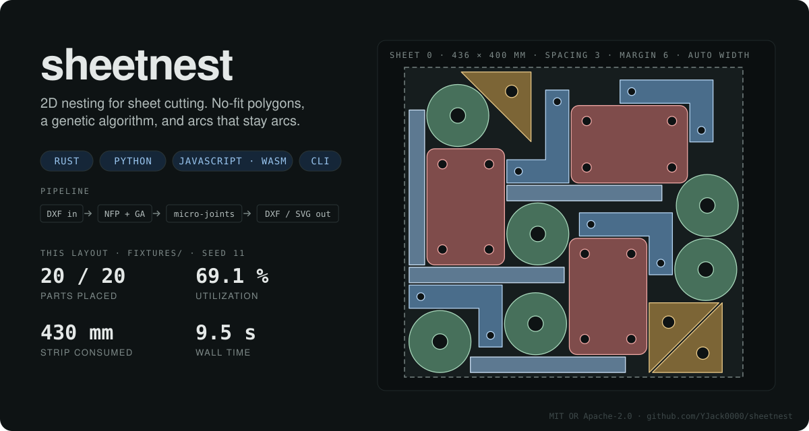

# sheetnest

<p align="center">
  
</p>

2D nesting for sheet cutting: pack parts onto rectangular stock with as
little waste as possible, and hand the cutter a DXF it can use as-is.

- **No-fit polygon + genetic algorithm.** The same algorithm family as
  SVGnest, implemented natively in Rust on top of Clipper2. A 13-part
  production job nests in seconds, not minutes.
- **Arcs stay arcs.** Circles and fillets go from the input DXF to the
  output DXF as true `ARC` entities. Only splines and ellipses are
  linearized, at a tolerance you choose.
- **Coil-friendly.** `auto_width` treats the stock as a strip of unbounded
  length and minimizes how far along the coil you have to cut, which is
  usually the number the shop actually cares about.
- **Micro-joints.** Optional tabs (bridges left uncut) placed by laser
  best practice: on straight edges, away from corners, evenly spaced,
  skipped on small holes.
- **Rotation modes.** Orthogonal (0/90/180/270) for grained material, or
  free rotation in a configurable step.
- **Reproducible and cancellable.** Seed the run, watch progress per
  generation, stop early and keep the best layout so far.

All lengths are millimeters, angles are degrees, y is up.

## Rust

```toml
[dependencies]
sheetnest = "0.1"
```

```rust
use sheetnest::{Hooks, NestConfig, Part, Pt, dxf, nest, to_dxf};

fn main() -> anyhow::Result<()> {
    // Parts from a drawing (any closed loops; nested loops become holes) ...
    let bracket = dxf::parse_dxf(&std::fs::read("bracket.dxf")?, "bracket", 4, 0.25)?;
    // ... or from plain vertex rings.
    let plate = Part::from_polygon(
        "plate",
        2,
        &[Pt::new(0.0, 0.0), Pt::new(120.0, 0.0), Pt::new(120.0, 80.0), Pt::new(0.0, 80.0)],
        &[],
    )?;

    let mut parts = bracket.parts;
    parts.push(plate);

    let cfg = NestConfig {
        sheet_width: 1829.0,
        sheet_height: 914.0,
        spacing: 2.0,
        margin: 5.0,
        time_limit_ms: 20_000,
        seed: Some(42),
        ..NestConfig::default()
    };
    let hooks = Hooks::new().on_progress(|p| {
        eprintln!("gen {} util {:.1}%", p.generation, p.best_utilization * 100.0)
    });

    let solution = nest(&parts, &cfg, hooks)?;
    println!(
        "{} of {} placed on {} sheet(s), {:.1} mm used, {:.1}% utilization",
        solution.stats.placed,
        solution.stats.total,
        solution.stats.sheets_used,
        solution.stats.used_width,
        solution.stats.utilization * 100.0
    );
    std::fs::write("nested.dxf", to_dxf(&solution, &parts, &cfg)?)?;
    Ok(())
}
```

Every placement is `(part_id, instance, sheet, rotation_deg, dx, dy)`:
rotate the part's local geometry counter-clockwise about the origin, then
translate. `part_id` is the index into the slice you passed in.

### Features

| feature    | default | what it adds                                                   |
|------------|---------|----------------------------------------------------------------|
| `dxf`      | on      | `dxf::parse_dxf`, `dxf::write_dxf`, `to_dxf`                   |
| `svg`      | on      | `to_svg`, `to_svg_all` previews with `data-part` attributes    |
| `parallel` | on      | evaluate the GA population on all cores with rayon             |

The core (`nest`, `Part::from_polygon`, tabs) has no I/O and no threads
without these, which is what the wasm build uses.

### Configuration

| field               | default      | meaning                                                          |
|---------------------|--------------|------------------------------------------------------------------|
| `sheet_width`       | 1829         | usable stock length along X, mm                                  |
| `sheet_height`      | 914          | usable stock height, mm                                          |
| `auto_width`        | false        | ignore `sheet_width`; minimize the length consumed instead       |
| `spacing`           | 2            | minimum gap between parts, mm                                    |
| `margin`            | 5            | minimum gap between parts and the sheet edge, mm                 |
| `rotation_mode`     | `orthogonal` | `orthogonal` (0/90/180/270) or `free`                            |
| `rotation_step_deg` | 15           | step for `free` rotation                                         |
| `curve_tolerance`   | 0.25         | max chord error when linearizing curves for the nesting math, mm |
| `time_limit_ms`     | 20000        | hard stop                                                        |
| `stale_generations` | 600          | stop early after this many generations without improvement       |
| `population`        | 15           | GA population size                                               |
| `mutation_rate`     | 0.10         | per-gene mutation probability                                    |
| `seed`              | none         | RNG seed; makes stale-terminated runs reproducible               |
| `tabs`              | disabled     | micro-joint settings: width 0.3, spacing 250, corner clearance 3 |

`NestConfig` (de)serializes with serde as camelCase JSON, so the same
document configures the Rust, Python and JavaScript APIs.

## Command line

```bash
cargo install sheetnest-cli
sheetnest nest bracket.dxf:12 gusset.dxf:4 plate.dxf --sheet 2500x1250 --tabs -o job.dxf --svg job.svg
sheetnest validate job.dxf        # independent overlap / margin / gap checker
sheetnest bench fixtures/ 3       # nest every DXF in a directory, print metrics
```

Every `NestConfig` field has a flag (`--auto-width`, `--spacing`, `--rotation free`,
`--seed`, ...); `--config settings.json` loads a camelCase config file and flags
override it; `--json` prints the full solution. See
[crates/sheetnest-cli](crates/sheetnest-cli/README.md).

## Python

```bash
pip install sheetnest
```

```python
from pathlib import Path
from sheetnest import NestConfig, Part, nest

parts, warnings = Part.from_dxf(Path("bracket.dxf").read_bytes(), "bracket", quantity=12)
parts.append(Part.from_polygon("plate", 4, [(0, 0), (120, 0), (120, 80), (0, 80)]))

solution = nest(
    parts,
    NestConfig(sheet_width=1829, sheet_height=914, spacing=2, margin=5, seed=1),
    on_progress=lambda p: print(p.generation, p.best_utilization),
)
print(solution.stats.placed, "of", solution.stats.total, "placed on", solution.stats.sheets_used, "sheet(s)")
Path("nested.dxf").write_bytes(solution.to_dxf())
```

The GIL is released while the optimizer runs, Ctrl-C cancels and keeps the
best layout so far, and `should_stop=` lets you cancel from code. Wheels are
abi3 (CPython 3.9+) for Linux x86_64/aarch64, macOS arm64/x86_64 and Windows
x64. See [crates/sheetnest-py](crates/sheetnest-py/README.md).

## JavaScript / WebAssembly

```bash
npm install sheetnest
```

Same `Part` / `nest()` / `Solution` shape, config as a camelCase object,
single-threaded, meant to run inside a Web Worker (a nest blocks for
`timeLimitMs`). Node and browsers are both supported through the package
`exports`. See [crates/sheetnest-wasm](crates/sheetnest-wasm/README.md).

## How it works

`docs/design.md` walks through the pipeline step by step with the numbers
measured on real production parts. The short version:

1. **Parse.** Loose `LINE`/`ARC`/`SPLINE` entities are chained into closed
   loops by endpoint proximity; containment decides which loops are
   outers and which are holes.
2. **Prepare.** Outer rings are simplified to at most ~200 vertices for
   the NFP math and inflated by `spacing`; the sheet is shrunk by
   `margin`. Output still uses the exact geometry.
3. **Search.** A GA evolves the placement order and rotation index of
   every part instance. Tournament selection, order crossover, elitism.
4. **Decode.** For each individual, a deterministic greedy placer walks
   the order, computes no-fit polygons against everything already placed
   (cached per part pair and rotation), and picks the candidate that
   keeps the strip shortest, then left-most, then lowest.
5. **Score.** Fitness is the length of stock consumed along X plus a
   penalty per unplaceable instance. Not area utilization.
6. **Render.** Tabs are cut into each part's contours in local
   coordinates, then everything is transformed and written as DXF and/or
   SVG.

## Examples and tools

```bash
cargo run --release --example gen_fixtures          # synthetic DXF parts into fixtures/
cargo run --release --example inspect -- part.dxf   # what the parser sees
cargo run --release -p sheetnest-cli -- bench fixtures 3     # nest them, print metrics
cargo run --release -p sheetnest-cli -- validate out.dxf     # independent overlap/margin/gap checker
```

## Limitations

- Parts are not nested inside other parts' holes yet.
- Free rotation with many angles is slow on spline-heavy parts (each
  angle pair needs its own NFP); orthogonal mode is the fast path.
- The geometry kernel is Clipper2 (C++), so a C++ toolchain is needed to
  build from source (and the WASI SDK for the wasm target). Published wheels
  and the npm package are prebuilt.

## Roadmap

- [x] `sheetnest-cli`: `nest`, `validate`, `bench` subcommands
- [x] Python package (PyO3 + maturin)
- [x] npm package (wasm-bindgen)
- [ ] Nest small parts inside large parts' holes
- [ ] Multi-start: several short GA runs beat one long one on this landscape

## License

Licensed under either of [Apache License, Version 2.0](LICENSE-APACHE) or
[MIT license](LICENSE-MIT) at your option.

Extracted in August 2026 from the nesting engine of
[auto-flat](https://github.com/CeranaStudio/auto-flat), where it replaced
a pipeline that drove SVGnest through a headless browser.
